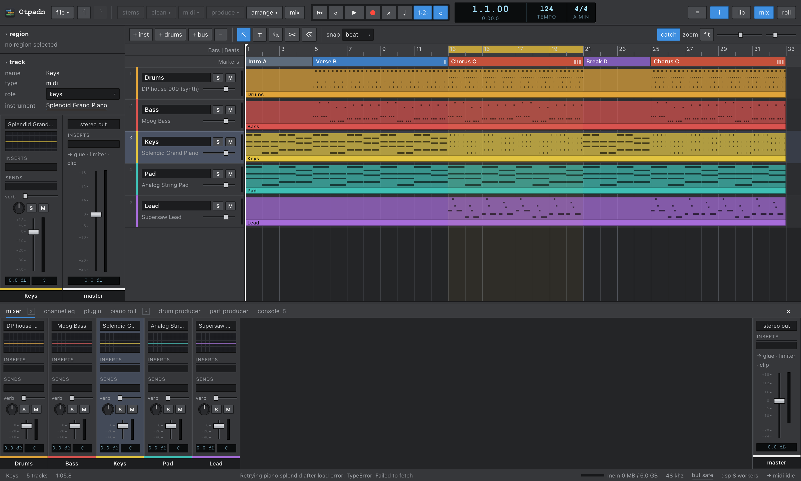
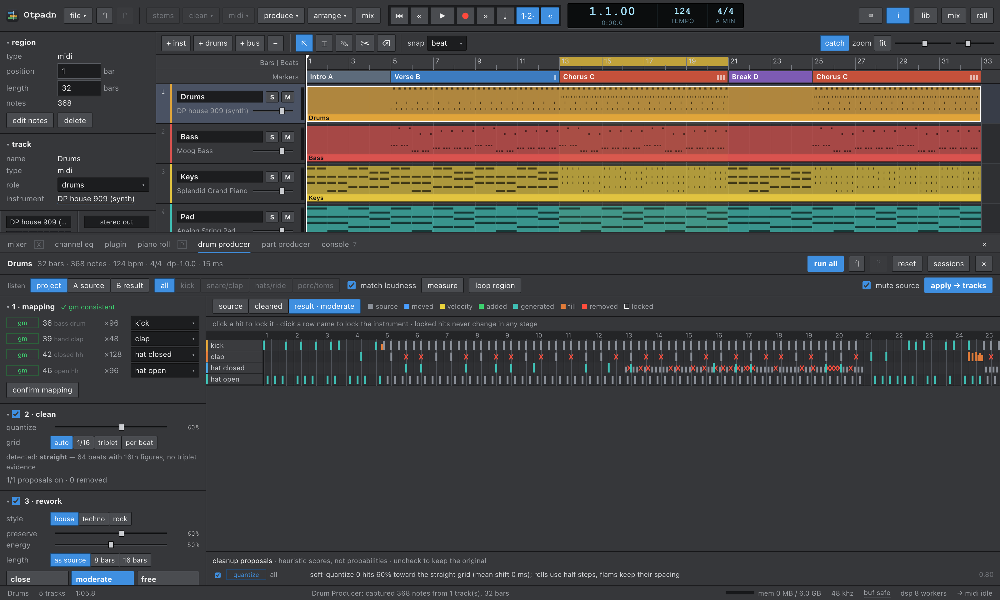

# Otpadn

**A music studio that runs entirely in your browser.** Drop in a song, split it into stems, turn the instruments into MIDI, rework the parts, and mix — all on your own computer. Nothing is uploaded.

**[Open Otpadn → daw.jenyadoesapps.com](https://daw.jenyadoesapps.com)**



---

## What it's for

You hear a song and want to work with it: practise a part, remix it, rebuild the drums, steal the chord voicings, or just see what's going on inside. Otpadn takes you from a finished mix to editable tracks in a few clicks, and then gives you a normal DAW to keep going.

## What you can do

**Take a song apart**
- **Split into stems** — drums, bass, vocals, guitar, piano and other, using an AI model that runs on your graphics card.
- **Clean a track** — remove room echo and background noise (great on vocals).
- **Turn audio into MIDI** — one MIDI track per instrument it hears, with a fitting sound already loaded.
- **Song analysis** — tempo, key, chords and sections (intro, verse, chorus…) are found automatically.

**Make the parts better**
- **Drum Producer** — turns messy drum MIDI into a clean, punchy part: fixes double hits and timing, keeps ghost notes and fills, then reworks it as *house*, *techno* or *rock*, with groove, fills and a matching drum kit. Three variations to choose from, every one reproducible.
- **Part Producer** — the same idea for **keys** (comping, house stabs, pads, arpeggios with smooth voice leading), a **vocal or lead line** (in key, tidy, with consistent repeats), **guitar** (playable chord shapes, strumming, fingerpicking, power chords) and **bass** (one note at a time, rests only where they mean something; roots, lock-to-kick and octave styles).
- **Arrange & mix** — build a section-aware arrangement and get an automatic first mix with balanced levels.

**Work like in any DAW**
- Timeline with regions, a **range tool for cutting slices** out of tracks (with or without closing the gap), split, trim and duplicate.
- **Piano roll** with box select, group moves, copy/paste, quantize and a velocity lane; guitar **tab view**.
- **Real instruments**: a multitrack acoustic drum kit, a multisampled 5-string bass, a Martin acoustic guitar and an electric guitar played through a modelled amp and real 4×12 cabinet responses (clean, crunch, high-gain).
- **Mixer** with EQ, inserts (compressor, limiter, multiband, delay, saturator, guitar amp, plate reverb), sends and buses.
- Recording with metronome and count-in, musical typing and MIDI keyboards.
- **Export** the mix or each track as WAV (24-bit), or everything as a `.mid` file — the whole song or just the cycle range.



## A typical session

1. **Drop a song** onto the window (WAV, MP3, FLAC, M4A).
2. **stems** — split it. The first time, the model downloads once.
3. **clean** — optional, for vocals or noisy recordings.
4. **midi** — select a stem and convert it to MIDI.
5. **produce** — right-click a MIDI region → *Drum Producer* or *Part Producer*. Pick a style and a variation, listen A/B against the original, then *apply*.
6. **arrange** / **mix** — let Otpadn draft an arrangement and a mix, then adjust by hand.
7. **file → bounce** — export the mix, the stems or the MIDI.

The buttons in the top bar are in this order, so you can work left to right.

## Your music stays on your computer

Everything — stem separation, transcription, analysis, mixing and export — runs inside your browser. Your audio is never sent anywhere. Projects save automatically in the browser and come back when you reopen the page.

The only things downloaded are the AI models and instrument samples, once, the first time you use them:

| What | Size | When |
|---|---|---|
| Stem separation model | ~136 MB | first stem split |
| Audio → MIDI model | ~200 MB (fast) or ~600 MB (accurate) | first conversion |
| Multitrack acoustic drum kit | ~16 MB | first time it plays |
| Bass · acoustic guitar · electric guitar | ~5 MB · ~0.5 MB · ~3 MB | first time each plays |
| Piano, electric pianos, orchestral sounds | a few MB each | when you pick them |

## What you need

- A recent **Chrome** or **Edge** on a desktop or laptop. AI stems and audio → MIDI use **WebGPU** (Safari 26+ works too).
- Enough free memory: a full song with its stems and models loaded takes several hundred MB. Otpadn keeps track of its own memory use and warns you before a step would run out.
- Headphones or speakers. The UI is built for a mouse or trackpad.

## Keyboard shortcuts

| Key | Action |
|---|---|
| Space | Play / stop |
| R · K | Record · metronome |
| C | Cycle (loop) on / off |
| , · . | Back / forward one bar |
| Enter | Back to start (or cycle start) |
| T | Next tool: pointer → range → pencil → scissors → eraser |
| ⌫ · ⇧⌫ | Delete · delete and close the gap (range tool) |
| ⌘T | Split at the playhead (or at the range edges) |
| ⌘D | Duplicate |
| ⌘Z · ⇧⌘Z | Undo · redo |
| Z | Zoom to fit |
| I · Y · E | Inspector · library · editor pane |
| X · P | Mixer · piano roll |
| ⌘O · ⌘B | Import audio · bounce the mix |
| Caps Lock | Musical typing (play the selected instrument from the keyboard) |

In the piano roll: double-click to add a note, drag on empty space to select, ↑↓ to transpose (⇧ for an octave), ←→ to move, ⌘A ⌘C ⌘X ⌘V ⌘D, Q to quantize.

## Run it yourself

You need [Node.js](https://nodejs.org) 20.19+ or 22.12+.

```bash
git clone https://github.com/hypnagonia/otpadn.git
cd otpadn
npm install
npm run dev        # open http://localhost:5173
```

```bash
npm run build      # type-check + production build into dist/
npm run preview    # serve the production build locally
```

The production build is a static site — any static host works (the live version runs on Vercel).

## How it works

Otpadn is a [Vite](https://vite.dev) + [React](https://react.dev) + TypeScript app. All audio runs on the Web Audio API; heavy work never blocks the interface:

| Work | Runs in |
|---|---|
| Stem separation (HTDemucs) | Web Worker, ONNX Runtime on WebGPU (WASM fallback) |
| Audio → MIDI | Web Worker, hand-written WebGPU transformer |
| Dereverb / denoise (DPDFNet) | Web Workers, one per channel |
| Drum & Part Producer analysis and generation | Web Worker, deterministic and seeded |
| Spectral features, loudness, waveforms, WAV encoding | Pool of DSP Web Workers |
| Effects (compressor, multiband, plate reverb…) | AudioWorklet (Otpadn's own DSP) |
| Bounces and exports | `OfflineAudioContext`, scheduled in slices so long songs render quickly |

A map of the source tree, for contributors, is in [`CLAUDE.md`](CLAUDE.md).

## Known limits

- Changing the tempo doesn't time-stretch audio; MIDI follows the new tempo.
- The song analysis (chords, sections) is a best guess — you can correct chords in the Part Producer.
- Projects are saved in the browser you used. There's no cloud save or project file yet.
- Only 4/4 time and a single tempo per song.

## Credits

Otpadn stands on the shoulders of open research and free sounds:

- **Audio → MIDI:** the MuScriptor model by Kyutai & Mirelo ([code](https://github.com/muscriptor/muscriptor), [paper](https://arxiv.org/abs/2607.08168)). Its weights are licensed **CC BY-NC 4.0 — personal and research use only, not commercial.** The WebGPU engine comes from [byEar](https://github.com/hypnagonia/chrome-ext-audio2midi).
- **Stem separation:** HTDemucs by Meta AI (MIT).
- **Dereverb + denoise:** DPDFNet-8 by CEVA ([upstream](https://github.com/ceva-ip/DPDFNet)), via [dpdfnet-webassembly](https://github.com/jenyanepoimannykh-it/dpdfnet-webassembly). See upstream for its licence.
- **Multitrack acoustic drums:** CrocellKit by Lars Muldjord for DrumGizmo, CC BY 4.0 (details in [`public/kits/crocell/LICENSE.txt`](public/kits/crocell/LICENSE.txt)).
- **Studio drums:** Virtuosity Drums from sfzinstruments (CC0).
- **Bass:** "Black And Blue Basses" by Karoryfer Samples (CC0).
- **Acoustic guitar:** 2017 Martin HD-28 samples by Jeff Learman, from the Discord SFZ GM Bank (CC0).
- **Electric guitar (DI):** "Electric Guitar FSBS (direct)" from the FreePats project (CC0).
- **Guitar cabinets:** "Jester's Brutal Pack" impulse responses by Jester Dyne Productions (CC0).
- Build script for these sample sets: [`tools/build_sampled_instruments.py`](tools/build_sampled_instruments.py); licence notes sit next to the samples in `public/instruments/`.
- **Sampled instruments:** free libraries loaded through [smplr](https://github.com/danigb/smplr) — Splendid Grand Piano, electric pianos, MusyngKite General MIDI, Mellotron and classic drum machines.

Because of the MuScriptor licence, **don't use the audio → MIDI feature commercially.**

## License

No open-source license has been chosen for Otpadn's own code yet. Third-party models and samples keep the licenses listed above.
